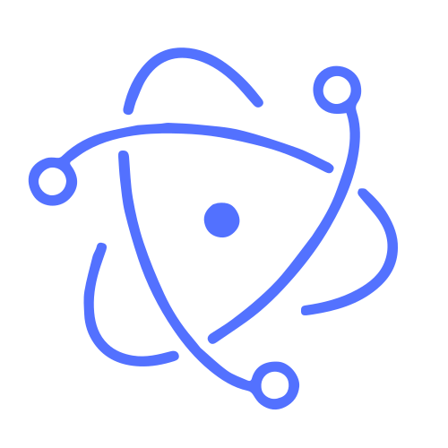

# ZKward: Signal Intelligence For Algorithmic Trading

ZKward aggregates prediction markets, funding rates, orderbook microstructure, options skew, and cross-asset
correlation into a single per-asset signal every 30 seconds. Each source's directional call is scored against realized
outcomes; sources below a 40% hit rate over 15+ observations are auto-killed. A fine-tuned language model reads every
new prediction-market title and extracts direction, horizon, and confidence at 82.8% resolved accuracy.

Signals feed an autonomous execution layer running on Sui mainnet and BlueFin perpetuals, guarded by a multi-agent
consensus gate and settled through post-quantum STARK attestation. A public shadow trader (`/paper`) runs the full
stack against $100k notional for anyone to verify strategy edge net of costs.

## Documentation

- [Changelog](docs/CHANGELOG.md)
- [Roadmap](docs/ROADMAP.md)

## Live deployment

Sui mainnet USDC pool — v0.2.0 on-chain, v0.4.2 off-chain (2026-09-21):

- Package: [`0x107292…7b726`](https://suiscan.xyz/mainnet/object/0x107292a69eea2f6eaf4a4e4727ee25d747b04c1985441b138933f0ef33f7b726)
- State: [`0xe814e0…42fb3a`](https://suiscan.xyz/mainnet/object/0xe814e0948e29d9c10b73a0e6fb23c9997ccc373bed223657ab65ff544742fb3a)

## Policies

- [Security policy](docs/SECURITY.md)
- [Contribution policy](docs/CONTRIBUTING.md)
- [Bug bounty](docs/BUG_BOUNTY.md)

## License

ZKward is distributed under the terms of the Apache License, Version 2.0 ([LICENSE](LICENSE) or
<http://www.apache.org/licenses/LICENSE-2.0>).

## Official Links

- [Website](https://www.zkward.com)
- [Shadow trader](https://www.zkward.com/paper)
- [Health](https://www.zkward.com/api/health/production)
- [GitHub](https://github.com/ZkVanguard)
- [X](https://x.com/HarveReg)
- [Telegram](https://t.me/anstemple)

## Disclaimer

ZKward operates real capital on Sui mainnet under a contract-enforced TVL cap. On-chain contracts are v0.2.0; the
off-chain system has been through 15 internal audit phases but no external audit has been completed. Forks and
independent deployments miss ongoing security updates and calibration — use at your own risk.
